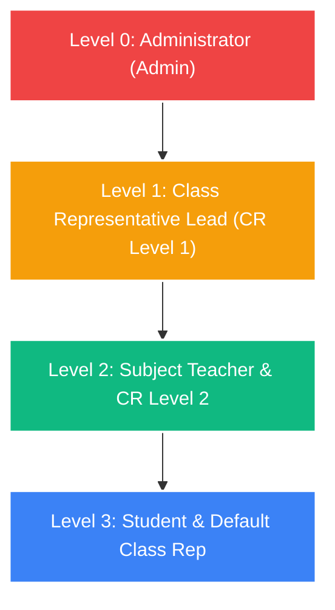
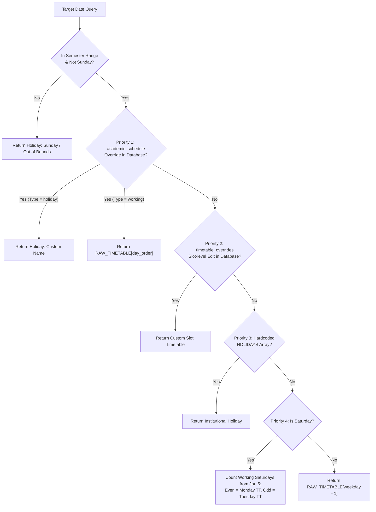
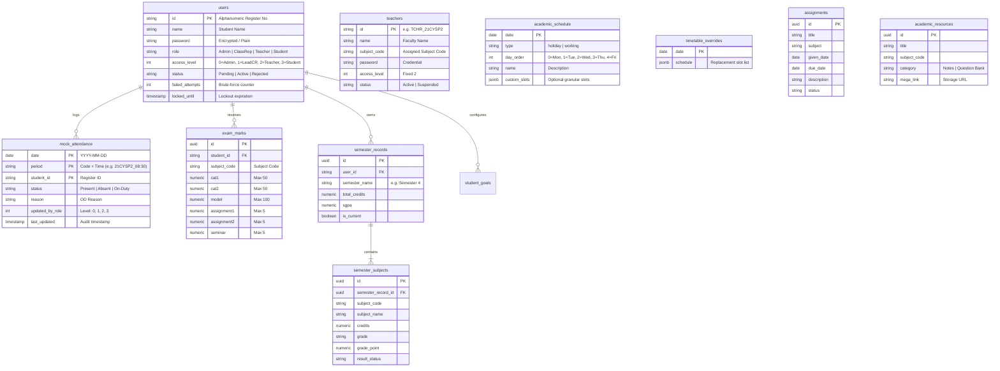

# ACFKA (Academic College Framework / Student Portal)
### Comprehensive Architecture, Domain Logic, and System Specification

> **Project Name:** ACFKA (Student Portal)  
> **Author & Lead Architect:** Abhishek Gali (dedicated to B.Tech CSE / Cybersecurity section A13 slot 2)  
> **Repository:** `Abhishek-Gali/ACFKA`  
> **Version:** 1.0.0-production  
> **Target Audience:** Autonomous AI Agents, LLM Coding Assistants, Institutional Auditors, and Developers.

---

## 1. Executive Summary & Purpose

**ACFKA** is a full-stack, real-time **Academic Intelligence & Student Governance Platform**. Developed over dozens of hours of deep design, testing, and iteration, the platform provides automated tools to track, predict, manage, and audit student academic journeys.

### Core Problems Solved
1. **Attendance Tracking & Bunk Intelligence:**
   Universities enforce rigid attendance minimums (typically 75% for exam hall ticket eligibility). ACFKA accurately counts periods conducted, accounts for On-Duty (OD) statuses, and projects bunk buffers (how many classes can be safely missed) or recovery requirements (how many consecutive classes must be attended to regain 75%).
2. **Dynamic Timetable Engine with Saturday Alternations:**
   College timetables follow complex rotation rules: working Saturdays alternate between Monday and Tuesday orders, while institutional holidays or departmental seminars override regular days. ACFKA provides a multi-tier fallback schedule engine with real-time slot editing.
3. **Continuous Internal Assessment (CIA) Normalization:**
   Consolidates CAT 1, CAT 2, Model Exams, Assignments, and Seminars into an internal score capped at 50 marks using institutional weighting models.
4. **CAMU ERP Transcript OCR & Target GPA Simulation:**
   Ingests student transcript PDFs, performs rasterized OCR with character whitelisting and fault-tolerant regex cleaning, extracts subject grades/credits, computes SGPA/CGPA, and runs mathematical feasibility models for future target CGPAs.
5. **Multi-Tier Hierarchical Governance (RBAC):**
   Enforces a 4-level numeric authority hierarchy across Students, Subject Faculty, Class Representatives, and Administrators, featuring precedence-locking on student attendance data.

---

## 2. Technology Stack & Key Dependencies

| Layer | Technologies & Libraries | Purpose & Usage Details |
| :--- | :--- | :--- |
| **Frontend Framework** | **React 19.2.0**, **Vite 7.2.4** | React 19 root concurrent rendering, Vite fast HMR, ES module bundling. |
| **Routing** | **React Router v7.13.0** | Client-side routing with role-based route guards and programmatic navigation. |
| **Backend & Database** | **Supabase (PostgreSQL 15+)** | Cloud PostgreSQL, Row Level Security (RLS), Realtime WebSocket channels (`@supabase/supabase-js 2.94.0`). |
| **Icons & Design** | **Lucide React 0.563.0**, Vanilla CSS | Glassmorphism design system, CSS `backdrop-filter`, ambient animations. |
| **OCR & PDF Processing** | **pdfjs-dist 5.4.624**, **Tesseract.js 7.0.0** | 2.5x upscaled canvas rendering + OCR worker with character whitelist for noisy marksheets. |
| **Spreadsheets & Export** | **xlsx (SheetJS) 0.18.5**, **file-saver 2.0.5** | Bulk export of schedules, marksheets, and attendance data to `.xlsx`. |
| **Haptics** | Web Vibration API (`navigator.vibrate`) | Native tactile feedback for mobile browsers on clicks, saves, deletions, and errors. |
| **Python Offline Suite** | **Python 3.12**, `pandas`, `pdfplumber`, `PyPDF2` | Offline PDF transcript regression testing, regex tuning, and OCR benchmarks under `analysis/`. |

---

## 3. Directory Layout & File Responsibilities

```
e:\Anti Gravity (Projects)\ACFKA\
│
├── 2026-SET - Holiday-Calendar-Full - 18-12-2025.pdf   # Official institutional academic calendar
├── calculate_periods.py                                # Prototype Python script for semester period counting
├── WhatsApp Image 2026-02-03 at 2.59.50 PM.jpeg       # Ground-truth timetable image
├── DOCUMENTATION.md                                    # This comprehensive specification document
│
└── student-portal/                                    # Full-Stack React Application
    ├── package.json                                    # Dependencies, scripts, and package metadata
    ├── vite.config.js                                  # Vite build settings & plugins
    ├── index.html                                      # SPA entry HTML
    ├── .env                                            # Supabase configuration (VITE_SUPABASE_URL, ANON_KEY)
    │
    ├── analysis/                                       # Offline OCR & Data Analysis Workbench
    │   ├── Semester 4.pdf                              # Real CAMU marksheet sample
    │   ├── verify_regex.py                             # Regex pattern testing against OCR text
    │   ├── pdf_analysis.py                             # PDF structure exploration
    │   ├── pdf_analysis.ipynb                          # Jupyter notebook for marksheet OCR pipeline
    │   └── extract_text_node.mjs                       # Node.js pdfjs-dist extraction script
    │
    └── src/
        ├── App.jsx                                     # Root component: Routes, persistent session, theme ticker
        ├── main.jsx                                    # React application DOM mounter
        ├── index.css / App.css                         # Glassmorphism styling, CSS variables, animations
        │
        ├── components/
        │   ├── Sidebar.jsx                             # Multi-role navigation sidebar with haptic hooks
        │   ├── BackgroundAnimation.jsx                 # Ambient fluid canvas background animation
        │   ├── ErrorBoundary.jsx                       # Global React component error boundary
        │   ├── ProfileManager.jsx                      # User profile editing modal
        │   └── ScrollPicker.jsx                        # Custom iOS-style wheel picker
        │
        ├── pages/
        │   ├── Login.jsx / Signup.jsx                  # Student authentication forms
        │   ├── AdminLogin.jsx / Admin.jsx              # System Administration suite (Users, Reps, Schedule)
        │   ├── ClassRepLogin.jsx / ClassRepPanel.jsx   # Class Representative dashboard
        │   ├── TeacherLogin.jsx / TeacherPanel.jsx     # Teacher portal (subject-specific workspace)
        │   ├── TeacherMarks.jsx                        # Faculty marks entry matrix
        │   ├── TeacherAssignments.jsx                  # Faculty assignment manager
        │   ├── StudentDashboard.jsx                    # Primary student interface (Timetable, Bunks, Metrics)
        │   ├── MockAttendance.jsx                      # Collaborative real-time attendance logging
        │   ├── MarksTracker.jsx                        # Student internal marks preview & simulation
        │   ├── SemesterPerformance.jsx                 # Transcript PDF upload, OCR parsing, CGPA simulator
        │   ├── CalendarPage.jsx                        # Interactive academic month calendar with schedule tooltips
        │   ├── Notes.jsx                               # Academic resource repository (Drive/Mega links)
        │   ├── Contacts.jsx                            # Student and faculty contact directory
        │   └── About.jsx                               # Creator credits & dedication page
        │
        ├── utils/
        │   ├── supabaseClient.js                       # Supabase client singleton initialization
        │   ├── auth.js                                 # Student/Admin/CR auth, lockout logic, user CRUD
        │   ├── auth_teacher_functions.js               # Faculty auth, lockout, and password management
        │   ├── security.js                             # XSS/SQLi sanitization, format validators
        │   ├── schedule.js                             # Timetable logic, Saturday alternator, override caches
        │   ├── attendance.js                           # Attendance percentages, safe bunk math, conducted map
        │   ├── mockAttendance.js                       # Period-level attendance upsert with role locking
        │   ├── marks.js                                # Internal assessment calculation formulas
        │   ├── semesterUtils.js                        # CGPA calculation, database upsert, target SGPA math
        │   ├── pdfProcessor.js                         # Canvas OCR + regex parser for CAMU PDFs
        │   ├── assignments.js                          # Assignment CRUD operations
        │   ├── contacts.js                             # Contact directory queries
        │   ├── exportUtils.js                          # Excel generation for schedules & marks
        │   ├── haptics.js                              # Web Vibration API patterns
        │   └── studentData.js                          # Synthetic mock student roster (Zero PII stored)
        │
        └── sql_schemas/
            ├── production_security_hardening.sql       # Master security migration (pgcrypto, RPCs, trigger, RLS)
            ├── supabase_schema.sql                     # Base tables: mock_attendance, contacts
            ├── teachers_schema.sql                     # Teachers table, RBAC policies, subject seeding
            ├── supabase_marks.sql                      # Exam marks table & constraints
            ├── supabase_semester.sql                   # Semester records, subject breakdown, goals
            └── security_updates.sql                    # Account lock columns (failed_attempts, locked_until)
```

---

## 4. Role-Based Access Control (RBAC) & Application Security Architecture

The application employs a **numeric authority scale** where **a lower numerical value indicates greater authority**:



### Access Matrix

| Feature / Action | Admin (Level 0) | Class Rep (Level 1) | Teacher (Level 2) | Student (Level 3) |
| :--- | :---: | :---: | :---: | :---: |
| **Manage User Approvals & Passwords** | Full | None | None | Self password only |
| **Create Class Reps & Teachers** | Full | None | None | None |
| **Declare Holidays / Working Days** | Full | Full | None | None |
| **Edit Timetable Slots per Date** | Full | Full | None | None |
| **Take / Edit Attendance** | Any period | Any period | Subject periods | Read only |
| **Override Existing Attendance Records** | Overrides all | Overrides L1-L3 | Overrides L2-L3 | None |
| **Enter / Edit Exam Marks** | All subjects | All subjects | Assigned subject | Self view only |
| **Upload Notes & Resources** | All subjects | All subjects | Assigned subject | Download only |

### 4.1 Server-Enforced Authentication & Password Security
- **Bcrypt Hashing via `pgcrypto`:** All user and teacher passwords are encrypted using PostgreSQL's native `crypt(password, gen_salt('bf', 10))`. Plaintext credentials are strictly prohibited from database storage.
- **Server-Side Stored Procedures (`SECURITY DEFINER`):** Authentication occurs entirely inside PostgreSQL via `auth_login` and `auth_teacher_login`. Direct `SELECT` of the `password` column is revoked from public/anon roles.
- **Timing-Attack Defense:** If a requested user ID is not found, the authentication function executes a dummy bcrypt comparison against a fixed salt to equalize execution time, mitigating username enumeration via side-channel timing analysis.

### 4.2 Database-Enforced Brute-Force Lockout
Client-side lockout checks can be easily bypassed by calling API endpoints directly. ACFKA enforces brute-force protection inside PostgreSQL:
- After **7 failed attempts**, the stored procedure atomically updates `locked_until = NOW() + INTERVAL '5 minutes'`.
- Any subsequent attempt during the lockout window is rejected at the database level before checking passwords.
- Successful authentication resets `failed_attempts = 0` and `locked_until = NULL`.

### 4.3 Database Trigger Hierarchy Lock (Attendance Precedence)
To prevent unauthorized attendance overwrites via raw PostgREST requests, PostgreSQL enforces authority precedence via a trigger:
```sql
CREATE OR REPLACE FUNCTION public.check_mock_attendance_authority()
RETURNS TRIGGER LANGUAGE plpgsql AS $$
BEGIN
    IF TG_OP = 'UPDATE' THEN
        -- Rejects if a lower-authority user attempts to overwrite a higher-authority record
        IF OLD.updated_by_role IS NOT NULL AND NEW.updated_by_role > OLD.updated_by_role THEN
            RAISE EXCEPTION 'Security Policy Violation: Record locked by authority level % cannot be overwritten by level %',
                OLD.updated_by_role, NEW.updated_by_role;
        END IF;
    END IF;
    RETURN NEW;
END;
$$;
```
If an **Admin (0)** or **Class Rep (1)** marks a student Absent, a **Teacher (2)** cannot alter that record at either the UI or API layer.

### 4.4 Real AppSec: SQL Injection & XSS Defenses
- **SQL Injection:** Mitigated architecturally via **Parameterized Queries** over PostgREST prepared statements and PostgreSQL typed function parameters. Naive client-side regex replacement is discarded.
- **Cross-Site Scripting (XSS):** Mitigated via React's contextual JSX escaping. Untrusted string boundaries are bounded using length limits and strict alphanumeric whitelisting (`/^[a-zA-Z0-9_-]{3,32}$/`).
- **Data Privacy & PII Compliance:** All student rosters in `studentData.js` contain synthetic mock data. Real student names and institutional register numbers have been completely sanitized from the repository.

---

## 5. Academic Timetable & Scheduling Engine

### Academic Calendar Parameters
- **Semester Start:** January 5, 2026 (`SEMESTER_START`)
- **Model Exam Start:** April 20, 2026 (`MODEL_EXAM_START`)
- **Semester End:** April 29, 2026 (`SEMESTER_END`)

### Core Curriculum Subjects & Faculty Mapping
| Code | Subject Name | Faculty | Drive Link / Resources |
| :--- | :--- | :--- | :--- |
| `21CYSP2` | Web Mining Lab | Mrs. D. Sasikala | Google Drive linked |
| `21GEN06` | Disaster Management | Dr. M. G. Geena | Google Drive linked |
| `21INT01` | Info Retrieval System | Dr. N. Sundara Rajulu | Google Drive linked |
| `21AID10` | Data Analytics | Mrs. D. Sasikala | Google Drive linked |
| `21CYS04` | Web Mining | Mrs. Sasikala | Google Drive linked |
| `21OEE13` | Sensors and Transducers | Mrs. R. Devika | Google Drive linked |
| `21CSE10` | Cryptography & Network Security | Dr. N. Sundara Rajulu | Google Drive linked |
| `21CSEMP` | Mini Project | Dr. N. Sundara Rajulu | Google Drive linked |
| `21ENGP3` | Professional Communication Lab | Mr. A. Joseph Vinoth Kumar | Google Drive linked |

### Schedule Resolution Pipeline
`getScheduleForDate(date)` resolves each date in descending priority:



### Alternating Saturday Logic
$$\text{workSatCount} = \sum_{d = \text{Jan 5}}^{\text{TargetDate}} [d \text{ is Saturday} \land d \notin \text{Holidays}]$$
$$\text{Timetable} = \begin{cases} \text{Monday Order (0)}, & \text{if } \text{workSatCount} \bmod 2 = 0 \\ \text{Tuesday Order (1)}, & \text{if } \text{workSatCount} \bmod 2 = 1 \end{cases}$$

### Prefetch Caching
`prefetchMonthData(year, month)` batches all overrides for an entire month into `timetableOverridesCache` in a single query, preventing $O(N)$ HTTP requests on calendar renders.

---

## 6. Mathematical Formulations

### 6.1 Attendance & Bunk Forecasts (`attendance.js`)
Let:
- $P$ = Total periods marked Present
- $OD$ = Total periods marked On-Duty
- $C$ = Total conducted periods to date
- $T$ = Total scheduled periods in semester
- $\theta = 0.75$ (75% minimum threshold)

$$\text{Attended Count } A = P + OD$$
$$\text{Current Attendance \%} = \frac{A}{C} \times 100$$
$$\text{Projected Attendance \%} = \frac{A + (T - C)}{T} \times 100$$

#### Maximum Bunk Allowance
$$\text{Bunks Allowed } B = \left\lfloor A + (T - C) - (\theta \times T) \right\rfloor$$
- If $B > 0$: Student can miss $B$ periods while remaining at or above 75%.
- If $B < 0$: Student cannot achieve 75% even with 100% future attendance.

#### Recovery Classes Required
When current attendance falls below 75%:
$$\frac{A + R}{C + R} \ge 0.75 \implies R \ge \lceil 3C - 4A \rceil$$
$$R = \max(0, \lceil 3C - 4A \rceil)$$

---

### 6.2 Continuous Internal Assessment (CIA) Normalization (`marks.js`)
Max internal score is 50 marks:
$$\text{CAT 1 (50)} \implies S_{\text{cat1}} = c_1 \times 0.2 \quad (\text{Max } 10)$$
$$\text{CAT 2 (50)} \implies S_{\text{cat2}} = c_2 \times 0.2 \quad (\text{Max } 10)$$
$$\text{Model Exam (100)} \implies S_{\text{model}} = \frac{m}{6.6} \quad (\text{Max } 15)$$
$$\text{Assignment 1} = a_1 \quad (\text{Max } 5)$$
$$\text{Assignment 2} = a_2 \quad (\text{Max } 5)$$
$$\text{Seminar} = s \quad (\text{Max } 5)$$

$$\text{Internal Total} = \min\left(50, \; S_{\text{cat1}} + S_{\text{cat2}} + S_{\text{model}} + a_1 + a_2 + s\right)$$

---

### 6.3 GPA & Target Goal Feasibility (`semesterUtils.js`)
Grade points mapping:
$$\text{O} = 10, \; \text{A+} = 9, \; \text{A} = 8, \; \text{B+} = 7, \; \text{B} = 6, \; \text{C} = 5, \; \text{P} = 4, \; \text{RA/Fail} = 0$$

$$\text{SGPA} = \frac{\sum (\text{Credits}_i \times \text{GP}_i)}{\sum \text{Credits}_i}, \quad \text{CGPA} = \frac{\sum (\text{SGPA}_j \times \text{SemCredits}_j)}{\sum \text{SemCredits}_j}$$

#### Target SGPA Math
$$\text{Required SGPA}_{\text{next}} = \frac{\text{Target CGPA} \times (C_{\text{curr}} + C_{\text{next}}) - (\text{Current CGPA} \times C_{\text{curr}})}{C_{\text{next}}}$$

#### Feasibility Categories
- $\le 7.5$: **Easily Achievable**
- $7.5 - 9.0$: **Achievable**
- $9.0 - 10.0$: **Challenging (Requires High Performance)**
- $> 10.0$: **Mathematically Impossible**

---

## 7. Transcript OCR & PDF Processing Pipeline

Institutional CAMU transcripts are ingested via [pdfProcessor.js](file:///e:/Anti%20Gravity%20%28Projects%29/ACFKA/student-portal/src/utils/pdfProcessor.js):
1. **Canvas Rasterization:** Each page rendered at **2.5x scale** to preserve edge clarity on small fonts.
2. **Character Whitelist OCR:** Tesseract.js initialized with:
   `tessedit_char_whitelist: 'ABCDEFGHIJKLMNOPQRSTUVWXYZabcdefghijklmnopqrstuvwxyz0123456789-:().+ '`
3. **Artifact Correction:** OCR character confusions automatically remapped:
   - `'(e]'`, `'[e]'`, `'0'` recognized as grade $\to$ converted to `'O'` (Outstanding, 10 GP).
   - Noise in Grade Point column $\to$ recomputed from Grade letter.
4. **Structured Parsing:** Regular expression extracts each course row:
   ```regex
   Semester-(\d+)\s+(.+?)[\s\u2013\u2014-]+\s*(\S+)\s+(\S+)\s+(\d+)\s+(Pass|Fail|RA|AB|FA)
   ```

---

## 8. Database Entity-Relationship Schema



---

## 9. UI / UX & Ambient Design System

1. **Circadian Theme Engine:**
   Heartbeat in `App.jsx` dynamically updates body classes according to local system time:
   - `06:00 - 11:59`: `.theme-morning`
   - `12:00 - 15:59`: `.theme-afternoon`
   - `16:00 - 18:59`: `.theme-sunset`
   - `19:00 - 05:59`: `.theme-night`
2. **Glassmorphic Styling:**
   Backdrop-blur containers (`--glass-bg: rgba(255, 255, 255, 0.05)`, border translucency, neon glow headers).
3. **Hardware Haptic Feedback:**
   `navigator.vibrate` integrated on touch devices for interactive actions.
4. **WebSocket Realtime Subscriptions:**
   Supabase channels deliver live UI updates when peers mark attendance or modify class schedules.

---

## 10. Development & Extension Guidelines

### Local Setup
```bash
cd "e:\Anti Gravity (Projects)\ACFKA\student-portal"
npm install
npm run dev
```

### Adding New Subjects or Faculty
1. Update `SUBJECTS` dictionary in `src/utils/schedule.js`.
2. Seed faculty user account via `src/teachers_schema.sql` or through the Admin Panel (`/admin`).

### Deploying Database Migrations
Run the SQL scripts in `student-portal/src/` through the Supabase SQL editor:
1. `supabase_schema.sql` (Base tables: attendance, contacts)
2. `teachers_schema.sql` (Teacher directory and subject assignment)
3. `supabase_marks.sql` (Exam marks schema)
4. `supabase_semester.sql` (Semester records & CGPA goals)
5. `production_security_hardening.sql` (**Critical Master Security Migration**: Enables `pgcrypto`, converts passwords to bcrypt, installs server-side authentication & lockout RPCs, installs attendance authority trigger, and hardens RLS).

### Sanitizing Historical Git Commits Before Public Showcase
If this repository is published to GitHub for job applications or resumes, scrub historical commits of any previously tracked student rosters:
```bash
# Using git-filter-repo (recommended industry tool)
pip install git-filter-repo

# Scrub studentData.js history while keeping the current sanitized version
git filter-repo --path student-portal/src/utils/studentData.js --invert-paths --force

# Or squash commits into a clean initial release
git checkout --orphan clean-main
git add -A
git commit -m "feat: initial release with hardened security architecture"
```
