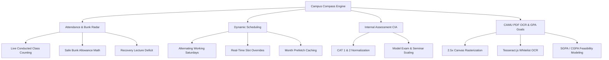

<div align="center">

# 🎓 Campus Compass (ACFKA)
### High-Performance Academic Governance & Attendance Intelligence Platform

[](https://react.dev/)
[](https://vitejs.dev/)
[](https://www.postgresql.org/)
[](https://supabase.com/)
[](./DOCUMENTATION.md)
[](LICENSE)

*An end-to-end academic management and predictive attendance engine engineered with multi-tier role-based access control, database-enforced security boundaries, and OCR marksheet ingestion.*

---

</div>

## 📌 Overview

**Campus Compass (ACFKA)** is a full-stack academic governance platform built to solve real-world college scheduling, attendance thresholds, and performance forecasting challenges. 

Unlike conventional student portals, Campus Compass is designed with **strict Application Security (AppSec) principles**, ensuring that role authority hierarchies, brute-force defenses, and authorization policies are strictly enforced in the database engine—not just in frontend UI logic.

---

## 🔒 Security & AppSec Architecture

Built from the ground up to resist common API and web application vulnerabilities:

- 🛡️ **Database-Enforced Brute-Force Defense:** Account lockout (7 failed attempts $\to$ 5-minute cooldown) is enforced atomically via PostgreSQL `SECURITY DEFINER` stored procedures (`auth_login`, `auth_teacher_login`). Client-side bypass via raw API requests is impossible.
- 🔑 **Cryptographic Password Hashing (`pgcrypto`):** Uses salted `bcrypt` hashes (`crypt(password, gen_salt('bf', 10))`). Direct `SELECT` queries on the `password` column are permanently revoked from public and anonymous database roles.
- ⏱️ **Timing-Attack Mitigation:** The database authentication routine executes a dummy bcrypt comparison when a non-existent user is queried, eliminating user-enumeration vulnerabilities via response latency profiling.
- 🚦 **Trigger-Level Precedence Locks:** A PostgreSQL `BEFORE UPDATE` trigger on `mock_attendance` physically prevents lower authority tiers (e.g. Teacher Level 2) from overwriting attendance records entered by higher authority tiers (e.g. Admin Level 0 or Lead CR Level 1).
- 💉 **SQL Injection & XSS Immunity:** Architectural protection using strictly parameterized prepared statements over PostgREST and typed PostgreSQL parameters, paired with React JSX contextual output encoding.
- 🔏 **Zero PII Exposure:** Repository is fully sanitized of real student identities, incorporating a synthetic mock roster (`studentData.js`) and environment credential templates (`.env.example`).

---

## 🚀 Key Functional Capabilities



### 1. 📊 Predictive Attendance & "Safe Bunk" Intelligence
- Dynamically counts conducted classes against the academic calendar to compute true attendance percentages.
- Calculates the **Safe Bunk Allowance** ($\lfloor A + (T - C) - 0.75T \rfloor$) — the maximum lectures a student can miss without dropping below the mandatory 75% threshold.
- Calculates **Recovery Classes Required** ($\max(0, \lceil 3C - 4A \rceil)$) to restore eligibility when attendance is in the critical warning zone.
- Supports On-Duty (OD) verification with customizable event presets (Sports, Symposium, Placement, Medical).

### 2. 📅 Dynamic Timetable Engine with Saturday Alternations
- Automatically determines whether a working Saturday follows a **Monday order** or **Tuesday order** using a parity algorithm over past working Saturdays.
- 4-tier schedule resolution hierarchy: Database Day Overrides $\to$ Custom Slot Overrides $\to$ Institutional Holiday Calendar $\to$ Standard Weekday Timetable.
- Month-level cache prefetching minimizes database queries on calendar rendering.

### 3. 🎯 Continuous Internal Assessment (CIA) Normalizer
- Automates conversion of Continuous Assessment Tests (CAT 1: 50 $\to$ 10 marks, CAT 2: 50 $\to$ 10 marks), Model Exam (100 $\to$ 15 marks), Assignments (10 marks), and Seminars (5 marks) into a standardized internal score out of 50.

### 4. 📄 Transcript OCR & Target GPA Feasibility
- Ingests CAMU ERP marksheet PDFs via canvas upscaling (2.5x) and character-whitelisted Tesseract.js OCR.
- Cleans common OCR recognition artifacts and reconstructs semester course credits and SGPAs.
- Models the mathematical feasibility of target CGPA goals for upcoming semesters.

---

## 👥 Role-Based Authority Hierarchy

| Authority Level | Role | Scope & Permissions |
| :---: | :--- | :--- |
| **Level 0** | **Administrator** | Full platform authority: user approvals, faculty provisioning, holiday declarations, timetable modifications, global marks entry. |
| **Level 1** | **Class Representative** | Day-order overrides, slot adjustments, full-class attendance logging, assignment publishing. |
| **Level 2** | **Subject Faculty** | Subject-scoped attendance, CIA marks entry matrix, assignment management, lecture notes sharing. |
| **Level 3** | **Student** | Personal timetable dashboard, bunk radar, internal marks tracker, transcript OCR simulator, study resources. |

---

## 🛠️ Tech Stack

- **Frontend:** React 19, Vite 7, React Router 7, Lucide Icons, Vanilla Glassmorphism CSS
- **Backend & Database:** Supabase, PostgreSQL 15+, PL/pgSQL Stored Procedures & Triggers
- **Document & Data Processing:** pdfjs-dist, Tesseract.js, SheetJS (xlsx), FileSaver
- **Security & Cryptography:** pgcrypto (bcrypt), Row Level Security (RLS), Parameterized PostgREST APIs

---

## ⚡ Quick Start

### 1. Clone & Install
```bash
git clone https://github.com/Abhishek-Gali/ACFKA.git
cd ACFKA/student-portal
npm install
```

### 2. Configure Environment Variables
Copy the template configuration:
```bash
cp .env.example .env
```
Fill in your Supabase credentials in `student-portal/.env`:
```env
VITE_SUPABASE_URL=https://your-project.supabase.co
VITE_SUPABASE_ANON_KEY=your-anon-public-key
```

### 3. Initialize Database
In your Supabase SQL Editor, execute the migration scripts located in `student-portal/src/`:
1. `supabase_schema.sql` (Core tables)
2. `teachers_schema.sql` (Teacher directory)
3. `supabase_marks.sql` (Internal marks schema)
4. `supabase_semester.sql` (Semester records & CGPA goals)
5. `production_security_hardening.sql` (**Master Security Migration**: Installs `pgcrypto`, bcrypt hashing, server-side lockout RPCs, and attendance authority triggers)

### 4. Run Development Server
```bash
npm run dev
```

### 5. Build for Production
```bash
npm run build
```

---

## 📚 In-Depth Technical Specification

For the complete architectural manual covering mathematical derivations, database entity-relationship models, and security threat modeling, review:
👉 **[DOCUMENTATION.md](./DOCUMENTATION.md)**

---

## 👨‍💻 Author

**Abhishek Gali**  
*B.Tech Computer Science & Engineering (Cybersecurity)*  
Designed and architected with focus on Application Security, scalable database design, and student success.
